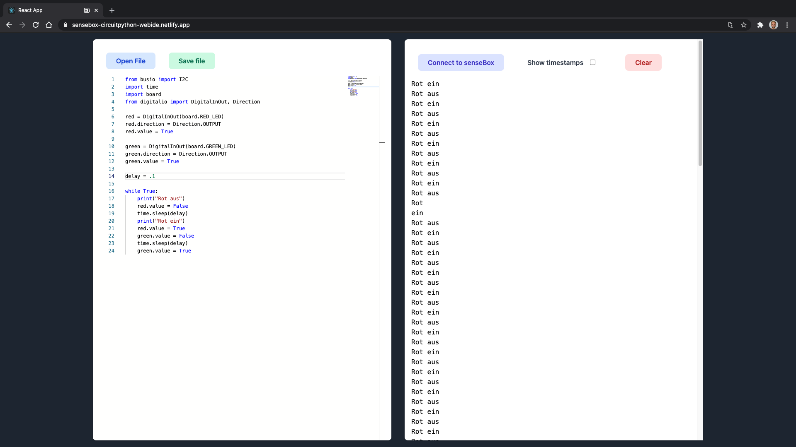

# CircuitPython WebIDE

This is a simple webide for circuitpython. It uses the latest WebAPIs like the The File System Access API or the Web Serial API.

It's only tested successfully on Chrome 89.

### Technology

- CRA
- TailwindCSS
- File System Access API
- Web Serial API
